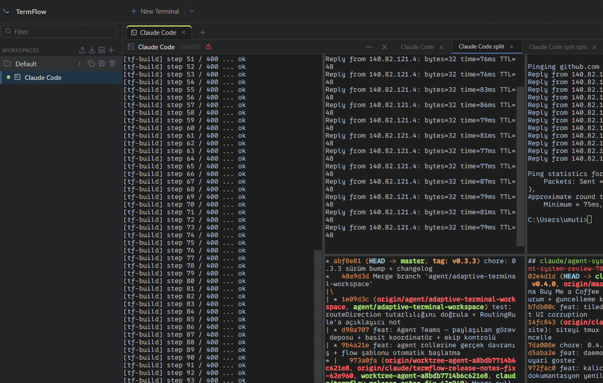
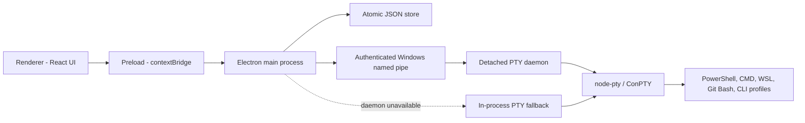

<h1 align="center">TermFlow</h1>
<p align="center">A tmux-inspired terminal multiplexer for Windows with persistent PTY sessions, tiled panes, and developer tooling.</p>

<p align="center">
  <a href="https://termflow.vercel.app">Website</a> ·
  <a href="#getting-started">Docs</a> ·
  <a href="https://github.com/palamut62/termflow/releases/latest">Download</a> ·
  <a href="https://github.com/palamut62/termflow/issues">Issues</a>
</p>

<p align="center">
  <a href="https://github.com/palamut62/termflow/releases/tag/v0.4.1"></a>
  <a href="LICENSE"></a>
  
  
  
  
</p>

<p align="center">
  
</p>

## Table of Contents

- [Overview](#overview)
- [Features](#features)
- [Keyboard Workflow](#keyboard-workflow)
- [Tech Stack](#tech-stack)
- [Architecture](#architecture)
- [Project Structure](#project-structure)
- [Getting Started](#getting-started)
- [Configuration](#configuration)
- [Usage](#usage)
- [Testing](#testing)
- [Packaging and Releases](#packaging-and-releases)
- [Plugin SDK](#plugin-sdk)
- [Roadmap](#roadmap)
- [Contributing](#contributing)
- [Security](#security)
- [FAQ](#faq)
- [License](#license)
- [Acknowledgments](#acknowledgments)

## Overview

TermFlow brings the tmux session/window/pane model to native Windows terminals. A workspace acts as a session, each session contains windows (tabs), and every window contains a binary tree of split panes.

PowerShell, PowerShell Core, CMD, WSL, Git Bash, and configured CLI tools such as Claude Code, Codex, and Gemini are all launch profiles. TermFlow does not orchestrate AI agents: it gives every shell and CLI the same real terminal environment.

Each pane runs through `@lydell/node-pty` and Windows ConPTY. In packaged builds, a detached per-user PTY daemon keeps terminals alive when the TermFlow window or application closes. Reopening TermFlow reattaches those processes and restores their scrollback. If the daemon is unavailable, TermFlow falls back to in-process PTYs and shows a `no detach` warning in the status bar.

## Features

### Sessions, Windows, and Panes

- **tmux-style hierarchy** - workspaces are sessions, tabs are windows, and terminals are panes.
- **Tiled by default** - new terminals join the active window as panes so all terminals stay visible.
- **Binary split tree** - split vertically or horizontally and drag dividers to resize.
- **Window management** - create, rename, reorder, switch, detach, and close windows from the tab strip or keyboard.
- **Pane navigation** - move directionally, cycle panes, or zoom one pane to fill the window.
- **Tile existing windows** - merge every window in a workspace into one tiled grid without stopping its processes.
- **Legacy migration** - older canvas workspaces migrate automatically into windows and pane layouts.

### Persistent Terminal Engine

- **Real PTYs** - every pane is backed by `@lydell/node-pty` over Windows ConPTY.
- **Persistent daemon** - terminals and scrollback survive quitting and reopening TermFlow.
- **Safe fallback** - an in-process backend keeps terminals usable when the daemon cannot start, with a visible warning that persistence is unavailable.
- **Five discovered shells** - PowerShell, PowerShell Core, CMD, WSL, and Git Bash.
- **Output control** - 16 ms batching, a 10,000-line buffer, and throttled rendering for inactive terminals.
- **Stable DOM rendering** - avoids stale WebGL atlas geometry when panes are resized across narrow and wide layouts.
- **Process statistics** - CPU and memory information for running terminals.

### tmux Keyboard Model

- **Configurable prefix** - use Ctrl+A (default) or Ctrl+B.
- **Send-prefix behavior** - press the prefix twice to send its raw control character to the shell.
- **Vi-style copy mode** - navigate scrollback, search, select, and copy without a mouse.
- **Traditional shortcuts remain available** - shortcuts such as Ctrl+Shift+D/E and Ctrl+Tab work alongside prefix commands.
- **Visible state** - the status bar displays `PREFIX` and `COPY` indicators.

### Launch Profiles and Developer Tools

- **Equal launch profiles** - shells and CLI tools use the same profile system.
- **Custom providers** - configure CLI/API-compatible tools without storing secrets in profile data.
- **Credential vault** - secrets are encrypted with Electron `safeStorage`, scoped globally or per workspace, and never returned to the renderer.
- **Developer Workbench** - browse files, preview safe text, inspect command history, and stage, unstage, diff, or commit Git changes.
- **Developer Center** - run manifest tasks, inspect project/runtime health, and export sanitized diagnostics.
- **Command palette** - press Ctrl+K to find workspaces, profiles, snippets, SSH entries, tasks, and actions.
- **Global terminal search** - search across live terminal buffers.
- **Task runner** - discover npm, pnpm, yarn, and bun scripts.
- **SSH profiles, snippets, recording, and broadcast input** - reusable tools for multi-terminal work.
- **Project manifests** - `.termflow.json` can define tasks, launch profiles, snippets, and environment placeholders.
- **Plugin SDK** - validate, test, package, and install capability-scoped `.tfplugin` extensions.

### Desktop Experience

- **Windows lifecycle integration** - optional start-at-login and system tray behavior.
- **Crash recovery** - recover a persisted session after an unclean shutdown or start clean.
- **Stable and beta updates** - GitHub Releases updater with progress and restart-to-install.
- **One-click update check** - the status bar shows the current version and update state.
- **Themes and transparency** - Latte, Frappé, Macchiato, Mocha, Matcha, Kanagawa, Ayu, and Rosé Pine palettes.
- **Atomic local storage** - settings and workspace metadata use a JSON store with rolling backup and corrupt-file recovery.

## Keyboard Workflow

Press the configured prefix key, then:

| Key | Action |
| --- | --- |
| `c` | Create a window |
| `t` | Tile all windows into one |
| `n` / `p` | Next / previous window |
| `0`-`9` | Jump to a window |
| `,` | Rename the active window |
| `d` | Detach the active window |
| `x` | Close the active pane |
| `%` / `"` | Split vertically / horizontally |
| `h` `j` `k` `l` or arrows | Move between panes |
| `o` | Cycle to the next pane |
| `z` | Zoom / unzoom the active pane |
| `[` | Enter copy mode |
| `?` | Show shortcut help |

Copy mode supports vi movement (`h/j/k/l`, `w/b`, `0/$`, `g/G`), half/full-page scrolling, forward/backward search, selection with `Space` or `v`, and copy with `Enter` or `y`. Multi-line selection is line-based because of the current xterm API.

## Tech Stack

| Technology | Purpose |
| --- | --- |
| Electron 39 | Windows desktop shell, process access, updater, and secure OS integrations |
| React 18 + TypeScript | Renderer UI and typed IPC contracts |
| xterm.js 6 | Terminal rendering, fitting, search, Unicode, and web links |
| `@lydell/node-pty` | Native PTY processes over Windows ConPTY |
| Zustand | Workspace, window, pane, terminal, and settings state |
| Node.js named pipes | Authenticated local transport between the app and PTY daemon |
| electron-vite | Development and production build pipeline |
| electron-builder | NSIS installer, ZIP, blockmap, and updater metadata |
| Vitest + Playwright | Unit, integration, and Electron end-to-end tests |

## Architecture



- **Renderer** owns the session/window/pane interface and terminal views.
- **Preload** exposes a typed, limited `window.termflow` API.
- **Main process** handles IPC, persistence, shell discovery, updates, and daemon attachment.
- **PTY daemon** runs outside the application window, authenticates local named-pipe messages with a per-session token, and preserves active PTYs across app restarts.

## Project Structure

```text
.
├── src/
│   ├── main/
│   │   ├── db/                    # Atomic JSON persistence
│   │   ├── ipc/                   # IPC handlers and backend selection
│   │   └── pty/
│   │       ├── PtyCore.ts         # Shared PTY lifecycle and buffering
│   │       ├── PtyManager.ts      # In-process fallback backend
│   │       └── daemon/            # Detached daemon, client, and launcher
│   ├── preload/                   # Typed contextBridge API
│   ├── renderer/src/
│   │   ├── canvas/
│   │   │   ├── WindowTabs.tsx     # Window tab strip
│   │   │   └── WindowView.tsx     # Split-pane tree
│   │   ├── components/            # Settings, workbench, help, status, etc.
│   │   ├── store/                 # Zustand store and slices
│   │   ├── copyMode.ts            # Vi-style scrollback navigation
│   │   ├── paneUtils.ts           # Pane split/close/resize operations
│   │   └── prefixKeys.ts          # tmux prefix handling
│   └── shared/
│       ├── ptyDaemonProtocol.ts    # Versioned daemon wire protocol
│       └── types.ts                # Shared models and IPC channels
├── e2e/                            # Electron Playwright tests
├── scripts/                        # Packaging and plugin tools
├── website/                        # Static product and download site
├── electron-builder.cjs
└── package.json
```

## Getting Started

### Download the Windows App

Download the current installer from [GitHub Releases](https://github.com/palamut62/termflow/releases/latest):

- `TermFlow-0.4.1-x64.exe` - Windows installer
- `TermFlow-0.4.1-x64.zip` - portable package

TermFlow currently targets Windows 10/11 x64. Release installers published on GitHub Releases are code-signed when signing credentials are configured for the release build; unsigned builds (local or fork builds) may trigger a Windows SmartScreen warning. You can check any download with `Get-AuthenticodeSignature .\TermFlow-0.4.1-x64.exe` — see [docs/code-signing.md](docs/code-signing.md).

### Development Prerequisites

- Windows 10 or 11
- Node.js 20+
- Git
- Optional: WSL and Git Bash
- Optional: any CLI tools you want to launch, such as Claude Code, Codex, Gemini, OpenCode, or Ollama

### Install and Run

```powershell
git clone https://github.com/palamut62/termflow.git
cd termflow
npm install
npm run dev
```

### Build and Verify

```powershell
npm run build
npm run verify
```

`npm run verify` runs the unit suite, TypeScript checks, and a production Electron build.

## Configuration

No `.env` file is required for the application itself. Settings are stored locally and edited in the in-app Settings panel.

| Setting | Default | Description |
| --- | --- | --- |
| Active border color | `#f5e642` | Focused pane border |
| Scrollback | `10000` | Lines retained per terminal |
| Passive throttle | `250 ms` | Render interval for unfocused terminals |
| Prefix key | `Ctrl+A` | tmux-style command prefix; Ctrl+B is also supported |
| New terminal opens | Pane | Open in the active tiled window or as a new window tab |
| AI auto-approve | Disabled | Add bypass flags to supported CLI profiles |
| Transparency | `100%` | Shared window, terminal, menu, and dialog opacity |
| Start at login | Enabled | Start packaged TermFlow with Windows |
| Minimize to tray | Enabled | Keep the application available from the system tray |
| Update channel | Stable | Stable or beta GitHub Releases channel |

Provider credentials belong in Settings > Developer > Credential Vault. Do not place secrets in launch profiles or `.termflow.json`.

## Usage

1. Create a workspace and select its working directory.
2. Add a shell or CLI launch profile. By default, additional terminals become panes in the active window.
3. Split, resize, navigate, and zoom panes with the toolbar or prefix commands.
4. Create separate windows when you need tabbed task groups.
5. Use prefix + `t` to merge all windows into a tiled view.
6. Use prefix + `[` for keyboard-driven scrollback and copying.
7. Close TermFlow normally; daemon-backed terminals continue running and reattach on the next launch.
8. Watch the status bar: `no detach` means TermFlow is using the non-persistent fallback backend.

### Project Manifest

Add `.termflow.json` to a workspace root to expose project actions:

```json
{
  "name": "My App",
  "tasks": [
    { "name": "Dev Server", "command": "npm run dev", "shell": "cmd" },
    { "name": "Tests", "command": "npm test", "shell": "cmd" }
  ],
  "agents": [
    { "name": "Codex", "role": "Coder", "kind": "codex" }
  ],
  "snippets": [
    { "name": "Git Status", "command": "git status" }
  ],
  "env": [
    { "key": "OPENAI_API_KEY", "masked": true }
  ]
}
```

AI CLI entries are launch profiles only; TermFlow v0.4.1 does not provide agent teams, routing, or workflow orchestration.

## Testing

```powershell
npm run test
npm run typecheck
npm run verify
npm run test:e2e
```

- `npm run test` runs Vitest tests for pane operations, copy mode, validation, persistence, and the daemon protocol.
- `npm run typecheck` validates the main, preload, shared, and renderer TypeScript projects.
- `npm run verify` runs tests, type checking, and a production build.
- `npm run test:e2e` builds and launches a real Electron window through Playwright.

## Packaging and Releases

```powershell
npm run package:verify
```

The verified Windows package produces:

- `dist/TermFlow-0.4.1-x64.exe`
- `dist/TermFlow-0.4.1-x64.zip`
- `dist/TermFlow-0.4.1-x64.exe.blockmap`
- `dist/latest.yml`

The daemon entry is unpacked from ASAR so it can run independently. Release the installer, ZIP, blockmap, and updater metadata together through GitHub Releases. The static product site lives in `website/` and is deployed separately to [termflow.vercel.app](https://termflow.vercel.app).

### Code Signing

Packaging is configured in `electron-builder.cjs`. Windows code signing is enabled automatically when the signing environment variables are present:

- Azure Trusted Signing: `AZURE_TENANT_ID`, `AZURE_CLIENT_ID`, `AZURE_CLIENT_SECRET`, `AZURE_ENDPOINT`, `AZURE_CODE_SIGNING_NAME`, `AZURE_CERT_PROFILE_NAME`, `AZURE_PUBLISHER_NAME`
- Certificate file fallback: `CERTIFICATE_FILE`, `CERTIFICATE_PASSWORD`

If they are missing, the build still succeeds and produces an unsigned installer with a warning in the log, so `npm run package` keeps working locally and on forks. `npm run package:verify` reports the installer's `Get-AuthenticodeSignature` status: `Valid` passes, `NotSigned` warns, any other status fails.

Setup instructions and secret descriptions live in [docs/code-signing.md](docs/code-signing.md). Tag pushes matching `v*` run `.github/workflows/release.yml`, which packages, verifies, and uploads the artifacts to a draft GitHub Release using the repository signing secrets.

## Plugin SDK

TermFlow supports validated manifest plugins and optional runtime plugins in an isolated utility process. Runtime code does not load into the renderer or Electron main process and receives only declared capabilities.

```powershell
npm run plugin -- init ./my-plugin
npm run plugin -- validate ./my-plugin
npm run plugin -- test ./my-plugin
npm run plugin -- pack ./my-plugin
npm run plugin -- install ./my-plugin
```

The generated `.tfplugin` bundle includes its manifest, runtime files, and SHA-256 integrity value. Registry packages must use HTTPS and may pin the expected bundle hash.

## Roadmap

- [x] tmux-style sessions, windows, and binary split panes
- [x] Configurable prefix-key workflow and pane zoom
- [x] Vi-style copy mode and search
- [x] Persistent PTY daemon with restart reattachment
- [x] Credential vault and updater status in the desktop UI
- [x] Automatic migration from legacy canvas workspaces
- [ ] Code signing for the Windows installer
- [ ] Terminal recording replay
- [ ] Multi-monitor detached terminal windows
- [ ] Linux and macOS PTY support
- [ ] Shared remote sessions

## Contributing

1. Fork the repository.
2. Create a focused branch.
3. Run `npm run verify`.
4. Include tests and screenshots for behavior or UI changes.
5. Open a pull request describing the change and verification performed.

Open an issue before starting a large architectural change.

## Security

TermFlow starts real operating-system processes with the current user's permissions. Auto-approve launch flags can grant AI CLI tools broad access; enable them only for directories you trust.

The PTY daemon accepts connections through a per-user Windows named pipe and authenticates protocol messages with a random session token stored in the user's application-data directory. Credential values use Electron `safeStorage` and are never returned to the renderer.

Report vulnerabilities privately through [GitHub Security Advisories](https://github.com/palamut62/termflow/security/advisories/new). Do not open a public issue for sensitive reports.

## FAQ

### Is TermFlow an AI agent orchestrator?

No. Since v0.4.1, TermFlow is a focused terminal multiplexer. Claude Code, Codex, Gemini, and similar tools run as ordinary CLI launch profiles.

### Do terminals survive closing TermFlow?

Yes, when the persistent PTY daemon is active. Reopening the application reattaches the processes and their scrollback. If TermFlow falls back to the in-process backend, the status bar shows `no detach` and those terminals end when the app quits.

### Does it work on Linux or macOS?

Not yet. The current packaged application targets Windows 10/11 x64 and uses Windows ConPTY.

### How is this different from tmux?

TermFlow adapts the session/window/pane and prefix-key model to native Windows PTYs with a graphical interface, system tray, Windows credential protection, Git-aware developer tools, and a Windows installer.

### Is v0.4.1 production-ready?

TermFlow is actively developed. The core terminal, persistence, pane, and updater workflows are implemented and tested, but breaking changes may still occur. Code signing is wired into the release pipeline and applies to signed release builds.

## License

TermFlow is distributed under the [MIT License](LICENSE).

## Acknowledgments

- [tmux](https://github.com/tmux/tmux) - inspiration for the session, window, pane, and prefix-key model
- [xterm.js](https://xtermjs.org/) - terminal rendering
- [Electron](https://www.electronjs.org/) - desktop application platform
- [@lydell/node-pty](https://github.com/microsoft/node-pty) - native pseudo-terminal bindings
- [Zustand](https://zustand-demo.pmnd.rs/) - application state management

